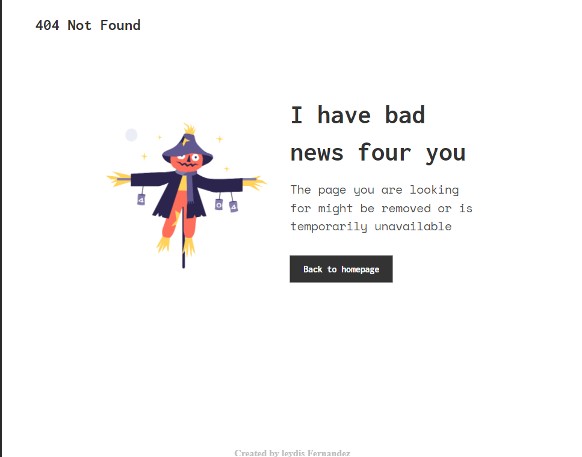

<!-- Please update value in the {}  -->

<h1 align="center">{404 Not Found}</h1>

<a href="https://leydisfh.github.io/404-not-found-/"> Demo</a>  

<!-- TABLE OF CONTENTS -->

## Table of Contents

[Overview](#overview) / [Built With](#built-with) / [Features](#features) /
[Contact](#contact) / [Acknowledgements](#acknowledgements)

<!-- OVERVIEW -->

## Overview

-  In this image you are seeing an image of the 404 page created
- In this exercise I was able to put my knowledge of Responsive Design into practice.

### Built With

<!-- This section should list any major frameworks that you built your project using. Here are a few examples.-->

- [HTML](https://developer.mozilla.org/en-US/docs/Web/HTML)
- [CSS](https://devdocs.io/css/)

## Features

<!-- List the features of your application or follow the template. Don't share the figma file here :) -->

This application/site was created as a submission to a [DevChallenges](https://devchallenges.io/challenges) challenge. The [challenge](https://devchallenges.io/challenges/wBunSb7FPrIepJZAg0sY) was to build an application to complete the given user stories.

## Acknowledgements

<!-- This section should list any articles or add-ons/plugins that helps you to complete the project. This is optional but it will help you in the future. For exmpale -->

- [Steps to replicate a design with only HTML and CSS](https://devchallenges-blogs.web.app/how-to-replicate-design/)
- [Node.js](https://nodejs.org/)
- [Marked - a markdown parser](https://github.com/chjj/marked)

## Contact

- GitHub [@leydisfh](github.com/Leydisfh)
- Linkedin [@linkedin](linkedin.com/in/leydis-fernández)
